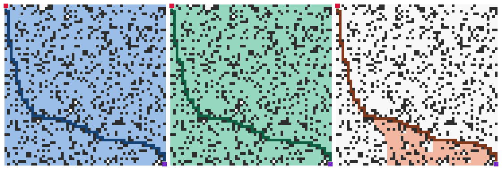
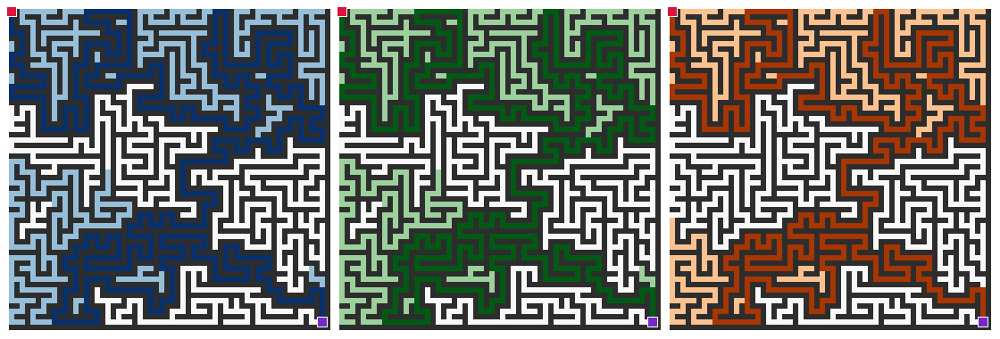
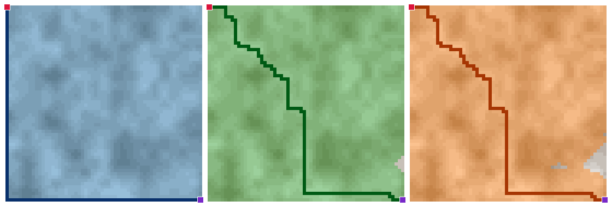
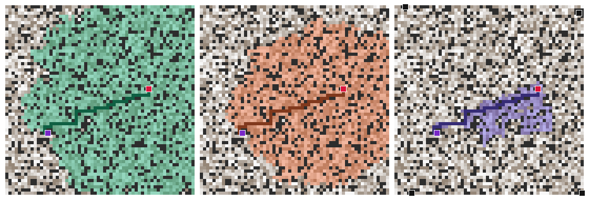
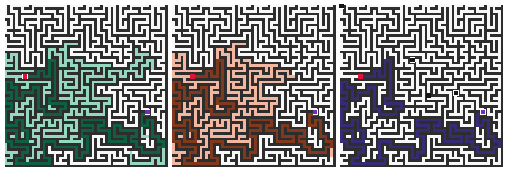
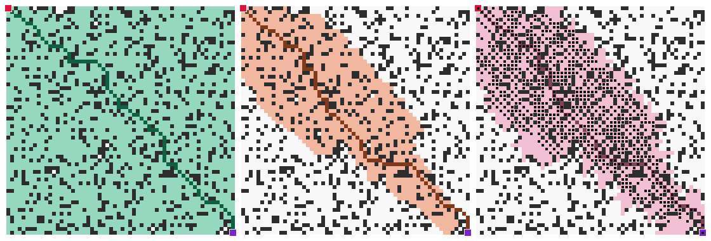
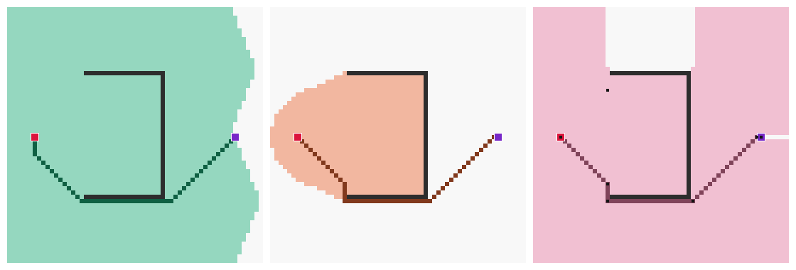

# Explored cells

Generated by `make figures`. Map size 60 x 60, seed 2026.

Each figure shows, left to right: **BFS | Dijkstra | A***.

| Color | Meaning |
| --- | --- |
| dark gray | wall |
| white -> warm gray | open cell, cost 1 -> 9 |
| light blue / aqua / orange | cells expanded by BFS / Dijkstra / A* |
| dark blue / aqua / orange | path returned |
| red / purple | start / goal |

Times are a single run made while drawing, for reference only. The numbers used for comparison are the experiment results in `results/`.

## Random obstacles 20%, unit cost

| | path cost | moves | expanded | max frontier | time (ms) |
| --- | ---: | ---: | ---: | ---: | ---: |
| BFS | 118 | 118 | 2826 | 53 | 2.12 |
| Dijkstra | 118 | 118 | 2826 | 53 | 4.21 |
| A* | 118 | 118 | 431 | 269 | 1.07 |

## Random obstacles 20%, cost 1-9 (same walls as above)

| | path cost | moves | expanded | max frontier | time (ms) |
| --- | ---: | ---: | ---: | ---: | ---: |
| BFS | 568 | 118 | 2826 | 53 | 3.07 |
| Dijkstra | 442 | 124 | 2826 | 74 | 7.97 |
| A* | 442 | 124 | 2826 | 99 | 15.34 |

## Perfect maze (exactly one path)

| | path cost | moves | expanded | max frontier | time (ms) |
| --- | ---: | ---: | ---: | ---: | ---: |
| BFS | 628 | 628 | 1165 | 5 | 1.24 |
| Dijkstra | 628 | 628 | 1165 | 5 | 1.53 |
| A* | 628 | 628 | 1048 | 6 | 1.75 |

## Maze with loops (10% extra openings)

| | path cost | moves | expanded | max frontier | time (ms) |
| --- | ---: | ---: | ---: | ---: | ---: |
| BFS | 156 | 156 | 1754 | 29 | 2.35 |
| Dijkstra | 156 | 156 | 1754 | 29 | 4.08 |
| A* | 156 | 156 | 1199 | 43 | 2.19 |

## No path (goal sealed off)

| | path cost | moves | expanded | max frontier | time (ms) |
| --- | ---: | ---: | ---: | ---: | ---: |
| BFS | no path | - | 2824 | 53 | 3.45 |
| Dijkstra | no path | - | 2824 | 53 | 6.49 |
| A* | no path | - | 2824 | 1039 | 11.91 |

## U-shaped wall (A* trap)

| | path cost | moves | expanded | max frontier | time (ms) |
| --- | ---: | ---: | ---: | ---: | ---: |
| BFS | 77 | 77 | 3443 | 71 | 2.53 |
| Dijkstra | 77 | 77 | 3443 | 71 | 5.49 |
| A* | 77 | 77 | 1037 | 102 | 4.31 |

## Terrain (cost 1-9 in patches)

| | path cost | moves | expanded | max frontier | time (ms) |
| --- | ---: | ---: | ---: | ---: | ---: |
| BFS | 538 | 118 | 3600 | 60 | 4.61 |
| Dijkstra | 375 | 118 | 3591 | 101 | 8.93 |
| A* | 375 | 118 | 3550 | 160 | 9.32 |

## City blocks (arterial 1, local road 3, jam 9)

| | path cost | moves | expanded | max frontier | time (ms) |
| --- | ---: | ---: | ---: | ---: | ---: |
| BFS | 266 | 118 | 975 | 21 | 1.13 |
| Dijkstra | 124 | 118 | 644 | 30 | 0.93 |
| A* | 124 | 118 | 225 | 36 | 0.44 |

# Landmarks (main experiment)

Left to right: **Dijkstra | A* + Manhattan | A* + 4 landmarks**. Random start and goal. Black squares in the right panel are the landmarks; their distances to every cell are computed before the search.

## Landmarks: random obstacles 20%, cost 1-9

| | path cost | expanded | time (ms) |
| --- | ---: | ---: | ---: |
| Dijkstra | 199 | 2192 | 3.65 |
| A* + Manhattan | 199 | 1635 | 3.29 |
| A* + 4 landmarks | 199 | 261 | 0.87 |

## Landmarks: maze

| | path cost | expanded | time (ms) |
| --- | ---: | ---: | ---: |
| Dijkstra | 336 | 857 | 1.97 |
| A* + Manhattan | 336 | 789 | 1.26 |
| A* + 4 landmarks | 336 | 337 | 0.83 |

## Landmarks: city, every road cost 1, 20% of road cells jammed (cost 9)

| | path cost | expanded | time (ms) |
| --- | ---: | ---: | ---: |
| Dijkstra | 154 | 349 | 0.72 |
| A* + Manhattan | 154 | 267 | 0.50 |
| A* + 4 landmarks | 154 | 77 | 0.39 |

# 8 directions and Jump Point Search

Left to right: **Dijkstra | A* (octile distance) | JPS**. Costs are in 8-direction units (straight 10, diagonal 14).

In the JPS panel the magenta tint marks cells JPS only *looked at* while jumping, and the black squares are the jump points it actually put on the heap.

## 8 directions: random obstacles 20%

| | path cost | expanded (JPS: jump points) | scanned while jumping | time (ms) |
| --- | ---: | ---: | ---: | ---: |
| Dijkstra | 958 | 2826 | - | 6.87 |
| A* | 958 | 1186 | - | 4.79 |
| JPS | 958 | 640 | 4838 | 8.26 |

## 8 directions: U-shaped wall

| | path cost | expanded (JPS: jump points) | scanned while jumping | time (ms) |
| --- | ---: | ---: | ---: | ---: |
| Dijkstra | 614 | 3290 | - | 9.78 |
| A* | 614 | 924 | - | 4.53 |
| JPS | 614 | 7 | 3831 | 3.93 |

## 8 directions: city blocks, every road cost 1

| | path cost | expanded (JPS: jump points) | scanned while jumping | time (ms) |
| --- | ---: | ---: | ---: | ---: |
| Dijkstra | 1180 | 975 | - | 1.87 |
| A* | 1180 | 766 | - | 2.82 |
| JPS | 1180 | 68 | 1003 | 1.13 |

## 8 directions: maze with loops

| | path cost | expanded (JPS: jump points) | scanned while jumping | time (ms) |
| --- | ---: | ---: | ---: | ---: |
| Dijkstra | 1560 | 1754 | - | 3.53 |
| A* | 1560 | 1408 | - | 4.35 |
| JPS | 1560 | 436 | 1694 | 4.40 |
