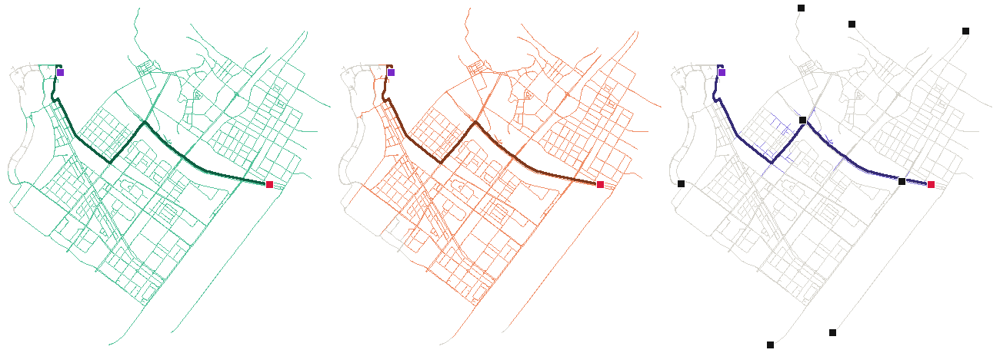
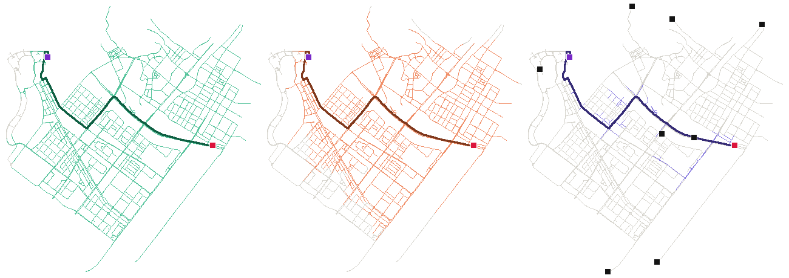
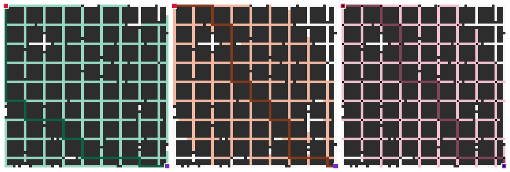

# Explored cells

Generated by `make figures`. Map size 60 x 60, seed 2026.

Each figure shows, left to right: **BFS | Dijkstra | A***.

| Color | Meaning |
| --- | --- |
| dark gray | wall |
| white -> warm gray | open cell, cost 1 -> 9 |
| light blue / aqua / orange | cells expanded by BFS / Dijkstra / A* |
| dark blue / aqua / orange | path returned |
| red / purple | start / goal |

Times are a single run made while drawing, for reference only. The numbers used for comparison are the experiment results in `results/`.

## Random obstacles 20%, unit cost

| | path cost | moves | expanded | max frontier | time (ms) |
| --- | ---: | ---: | ---: | ---: | ---: |
| BFS | 118 | 118 | 2826 | 53 | 2.49 |
| Dijkstra | 118 | 118 | 2826 | 53 | 4.41 |
| A* | 118 | 118 | 431 | 269 | 1.11 |

## Random obstacles 20%, cost 1-9 (same walls as above)

| | path cost | moves | expanded | max frontier | time (ms) |
| --- | ---: | ---: | ---: | ---: | ---: |
| BFS | 568 | 118 | 2826 | 53 | 3.04 |
| Dijkstra | 442 | 124 | 2826 | 74 | 4.57 |
| A* | 442 | 124 | 2826 | 99 | 5.81 |

## Perfect maze (exactly one path)

| | path cost | moves | expanded | max frontier | time (ms) |
| --- | ---: | ---: | ---: | ---: | ---: |
| BFS | 628 | 628 | 1165 | 5 | 1.44 |
| Dijkstra | 628 | 628 | 1165 | 5 | 1.61 |
| A* | 628 | 628 | 1048 | 6 | 1.79 |

## Maze with loops (10% extra openings)

| | path cost | moves | expanded | max frontier | time (ms) |
| --- | ---: | ---: | ---: | ---: | ---: |
| BFS | 156 | 156 | 1754 | 29 | 2.12 |
| Dijkstra | 156 | 156 | 1754 | 29 | 2.46 |
| A* | 156 | 156 | 1199 | 43 | 2.35 |

## No path (goal sealed off)

| | path cost | moves | expanded | max frontier | time (ms) |
| --- | ---: | ---: | ---: | ---: | ---: |
| BFS | no path | - | 2824 | 53 | 4.17 |
| Dijkstra | no path | - | 2824 | 53 | 7.33 |
| A* | no path | - | 2824 | 1039 | 6.85 |

## U-shaped wall (A* trap)

| | path cost | moves | expanded | max frontier | time (ms) |
| --- | ---: | ---: | ---: | ---: | ---: |
| BFS | 77 | 77 | 3443 | 71 | 2.62 |
| Dijkstra | 77 | 77 | 3443 | 71 | 5.51 |
| A* | 77 | 77 | 1037 | 102 | 3.11 |

## Terrain (cost 1-9 in patches)

| | path cost | moves | expanded | max frontier | time (ms) |
| --- | ---: | ---: | ---: | ---: | ---: |
| BFS | 538 | 118 | 3600 | 60 | 2.86 |
| Dijkstra | 375 | 118 | 3591 | 101 | 8.98 |
| A* | 375 | 118 | 3550 | 160 | 7.57 |

## City blocks (arterial 1, local road 3, jam 9)

| | path cost | moves | expanded | max frontier | time (ms) |
| --- | ---: | ---: | ---: | ---: | ---: |
| BFS | 266 | 118 | 975 | 21 | 0.79 |
| Dijkstra | 124 | 118 | 644 | 30 | 0.96 |
| A* | 124 | 118 | 225 | 36 | 0.46 |

# Landmarks (main experiment)

Left to right: **Dijkstra | A* + Manhattan | A* + 4 landmarks**. Random start and goal. Black squares in the right panel are the landmarks; their distances to every cell are computed before the search.

## Landmarks: random obstacles 20%, cost 1-9

| | path cost | expanded | time (ms) |
| --- | ---: | ---: | ---: |
| Dijkstra | 199 | 2192 | 3.59 |
| A* + Manhattan | 199 | 1635 | 6.57 |
| A* + 4 landmarks | 199 | 261 | 0.84 |

## Landmarks: maze

| | path cost | expanded | time (ms) |
| --- | ---: | ---: | ---: |
| Dijkstra | 336 | 857 | 1.15 |
| A* + Manhattan | 336 | 789 | 1.28 |
| A* + 4 landmarks | 336 | 337 | 0.78 |

## Landmarks: city, every road cost 1, 20% of road cells jammed (cost 9)

| | path cost | expanded | time (ms) |
| --- | ---: | ---: | ---: |
| Dijkstra | 154 | 349 | 0.54 |
| A* + Manhattan | 154 | 267 | 0.48 |
| A* + 4 landmarks | 154 | 77 | 0.26 |

# Real road map (Songdo, OpenStreetMap)

Left to right: **Dijkstra | A* + straight line | A* + 8 landmarks measured that hour** on the same start (red) and goal (purple). Light color = road segments leaving the points each search expanded, dark line = route found, black dots = landmarks. Map data (c) OpenStreetMap contributors, ODbL 1.0.

## 8h (morning peak)

| | travel time (s) | points expanded | time (ms) |
| --- | ---: | ---: | ---: |
| Dijkstra | 1104 | 4028 | 4.25 |
| A* + straight line | 1104 | 3687 | 14.27 |
| A* + 8 landmarks | 1104 | 303 | 0.86 |

## 3h (night, free flow)

| | travel time (s) | points expanded | time (ms) |
| --- | ---: | ---: | ---: |
| Dijkstra | 566 | 4010 | 4.33 |
| A* + straight line | 566 | 3278 | 6.37 |
| A* + 8 landmarks | 566 | 338 | 1.00 |

# 8 directions and Jump Point Search

Left to right: **Dijkstra | A* (octile distance) | JPS**. Costs are in 8-direction units (straight 10, diagonal 14).

In the JPS panel the magenta tint marks cells JPS only *looked at* while jumping, and the black squares are the jump points it actually put on the heap.

## 8 directions: random obstacles 20%

| | path cost | expanded (JPS: jump points) | scanned while jumping | time (ms) |
| --- | ---: | ---: | ---: | ---: |
| Dijkstra | 958 | 2826 | - | 10.01 |
| A* | 958 | 1186 | - | 8.60 |
| JPS | 958 | 640 | 4838 | 7.68 |

## 8 directions: U-shaped wall

| | path cost | expanded (JPS: jump points) | scanned while jumping | time (ms) |
| --- | ---: | ---: | ---: | ---: |
| Dijkstra | 614 | 3290 | - | 9.67 |
| A* | 614 | 924 | - | 4.65 |
| JPS | 614 | 7 | 3831 | 4.19 |

## 8 directions: city blocks, every road cost 1

| | path cost | expanded (JPS: jump points) | scanned while jumping | time (ms) |
| --- | ---: | ---: | ---: | ---: |
| Dijkstra | 1180 | 975 | - | 1.53 |
| A* | 1180 | 766 | - | 1.72 |
| JPS | 1180 | 68 | 1003 | 1.17 |

## 8 directions: maze with loops

| | path cost | expanded (JPS: jump points) | scanned while jumping | time (ms) |
| --- | ---: | ---: | ---: | ---: |
| Dijkstra | 1560 | 1754 | - | 2.85 |
| A* | 1560 | 1408 | - | 3.10 |
| JPS | 1560 | 436 | 1694 | 2.78 |
