# Experiment results

Generated by `make analyze` from the raw data in `results/`. Times are medians over 10 maps x 5 runs with the interquartile range (IQR) in brackets.

Measured on GitHub Codespaces: AMD EPYC 7763 64-Core Processor, 2 CPUs, Python 3.13.5, commit `3ac0d06`.

## A. Map size

Slope on the log-log chart: 1 means time grows in proportion to the number of cells.

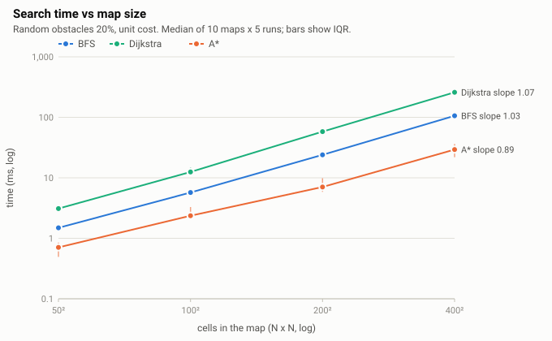

| algorithm | slope of time | slope of expanded |
| --- | ---: | ---: |
| BFS | 1.03 | 1.00 |
| Dijkstra | 1.07 | 1.00 |
| A* | 0.89 | 0.88 |

| condition | algorithm | time ms, median [IQR] | expanded | of reachable | stale | max frontier | cost / optimal | us per cell |
| --- | --- | ---: | ---: | ---: | ---: | ---: | ---: | ---: |
| random 20%, 50x50 | BFS | 1.49 [1.46-1.54] | 1,995 | 100% | 0 | 50 | 1.000 | 0.74 |
| random 20%, 50x50 | Dijkstra | 3.10 [3.05-3.19] | 1,995 | 100% | 0 | 50 | 1.000 | 1.55 |
| random 20%, 50x50 | A* | 0.71 [0.49-0.85] | 240 | 12% | 0 | 161 | 1.000 | 2.77 |
| random 20%, 100x100 | BFS | 5.72 [5.69-5.86] | 7,954 | 100% | 0 | 98 | 1.000 | 0.72 |
| random 20%, 100x100 | Dijkstra | 12.48 [12.28-14.75] | 7,954 | 100% | 0 | 98 | 1.000 | 1.57 |
| random 20%, 100x100 | A* | 2.36 [2.08-3.29] | 880 | 11% | 0 | 558 | 1.000 | 2.62 |
| random 20%, 200x200 | BFS | 23.96 [23.53-25.92] | 31,903 | 100% | 0 | 188 | 1.000 | 0.75 |
| random 20%, 200x200 | Dijkstra | 58.12 [55.51-62.84] | 31,903 | 100% | 0 | 188 | 1.000 | 1.82 |
| random 20%, 200x200 | A* | 7.04 [5.85-9.84] | 2,450 | 8% | 0 | 1,464 | 1.000 | 2.71 |
| random 20%, 400x400 | BFS | 106.11 [103.71-114.02] | 127,658 | 100% | 0 | 369 | 1.000 | 0.83 |
| random 20%, 400x400 | Dijkstra | 259.21 [251.90-270.46] | 127,658 | 100% | 0 | 369 | 1.000 | 2.03 |
| random 20%, 400x400 | A* | 29.35 [21.95-36.23] | 10,025 | 8% | 0 | 5,716 | 1.000 | 2.87 |

## B. Obstacle ratio

| condition | algorithm | time ms, median [IQR] | expanded | of reachable | stale | max frontier | cost / optimal | us per cell |
| --- | --- | ---: | ---: | ---: | ---: | ---: | ---: | ---: |
| random 0% | BFS | 30.26 [29.66-33.32] | 40,000 | 100% | 0 | 200 | 1.000 | 0.76 |
| random 0% | Dijkstra | 70.19 [67.29-77.77] | 40,000 | 100% | 0 | 200 | 1.000 | 1.75 |
| random 0% | A* | 1.17 [1.15-1.18] | 399 | 1% | 0 | 397 | 1.000 | 2.92 |
| random 10% | BFS | 27.41 [26.32-30.31] | 35,998 | 100% | 0 | 200 | 1.000 | 0.76 |
| random 10% | Dijkstra | 62.92 [60.58-64.80] | 35,998 | 100% | 0 | 200 | 1.000 | 1.74 |
| random 10% | A* | 6.29 [5.79-8.23] | 2,106 | 6% | 0 | 1,676 | 1.000 | 2.86 |
| random 20% | BFS | 24.37 [23.19-26.08] | 31,903 | 100% | 0 | 188 | 1.000 | 0.77 |
| random 20% | Dijkstra | 54.26 [52.25-55.44] | 31,903 | 100% | 0 | 188 | 1.000 | 1.70 |
| random 20% | A* | 7.09 [5.94-8.98] | 2,450 | 8% | 0 | 1,464 | 1.000 | 2.70 |
| random 30% | BFS | 20.04 [19.79-21.56] | 27,430 | 100% | 0 | 174 | 1.000 | 0.73 |
| random 30% | Dijkstra | 47.83 [44.64-50.38] | 27,430 | 100% | 0 | 174 | 1.000 | 1.74 |
| random 30% | A* | 7.76 [6.16-10.90] | 2,834 | 10% | 4 | 1,178 | 1.000 | 2.57 |

## C. Map kind

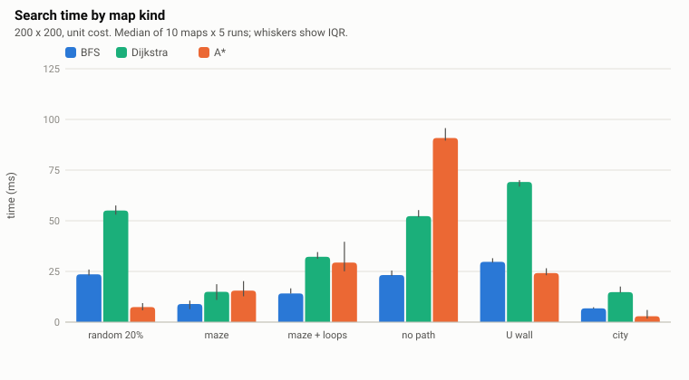

| condition | algorithm | time ms, median [IQR] | expanded | of reachable | stale | max frontier | cost / optimal | us per cell |
| --- | --- | ---: | ---: | ---: | ---: | ---: | ---: | ---: |
| random 20% | BFS | 23.59 [23.05-25.92] | 31,903 | 100% | 0 | 188 | 1.000 | 0.74 |
| random 20% | Dijkstra | 55.06 [53.00-57.54] | 31,903 | 100% | 0 | 188 | 1.000 | 1.72 |
| random 20% | A* | 7.40 [5.81-9.37] | 2,450 | 8% | 0 | 1,464 | 1.000 | 2.70 |
| maze | BFS | 8.92 [6.40-10.56] | 8,953 | 45% | 0 | 12 | 1.000 | 0.80 |
| maze | Dijkstra | 14.94 [10.93-18.69] | 8,953 | 45% | 0 | 12 | 1.000 | 1.35 |
| maze | A* | 15.52 [12.72-20.24] | 8,832 | 44% | 0 | 11 | 1.000 | 1.64 |
| maze + loops | BFS | 14.17 [14.06-16.67] | 20,862 | 100% | 0 | 106 | 1.000 | 0.68 |
| maze + loops | Dijkstra | 32.24 [31.25-34.56] | 20,862 | 100% | 0 | 106 | 1.000 | 1.55 |
| maze + loops | A* | 29.39 [25.03-39.63] | 14,346 | 68% | 572 | 227 | 1.000 | 2.09 |
| no path | BFS | 23.23 [22.80-25.44] | 31,900 | 100% | 0 | 188 | - | 0.73 |
| no path | Dijkstra | 52.27 [51.80-55.25] | 31,900 | 100% | 0 | 188 | - | 1.64 |
| no path | A* | 90.85 [89.54-95.71] | 31,900 | 100% | 12,330 | 10,513 | - | 2.85 |
| U wall | BFS | 29.75 [29.35-31.50] | 38,919 | 98% | 0 | 239 | 1.000 | 0.76 |
| U wall | Dijkstra | 69.14 [66.85-70.04] | 38,919 | 98% | 0 | 239 | 1.000 | 1.78 |
| U wall | A* | 24.20 [23.13-26.58] | 11,572 | 29% | 0 | 347 | 1.000 | 2.09 |
| city | BFS | 6.77 [6.68-7.33] | 10,232 | 100% | 0 | 74 | 1.000 | 0.66 |
| city | Dijkstra | 14.76 [14.53-17.56] | 10,232 | 100% | 0 | 74 | 1.000 | 1.44 |
| city | A* | 2.92 [1.76-5.96] | 1,506 | 15% | 0 | 156 | 1.000 | 1.94 |

## D. Cost model

| condition | algorithm | time ms, median [IQR] | expanded | of reachable | stale | max frontier | cost / optimal | us per cell |
| --- | --- | ---: | ---: | ---: | ---: | ---: | ---: | ---: |
| random 20% | BFS | 24.45 [23.33-26.22] | 31,903 | 100% | 0 | 188 | 1.000 | 0.77 |
| random 20% | Dijkstra | 54.71 [52.91-56.53] | 31,903 | 100% | 0 | 188 | 1.000 | 1.72 |
| random 20% | A* | 7.09 [5.97-9.29] | 2,450 | 8% | 0 | 1,464 | 1.000 | 2.69 |
| random 20%, cost 1-9 | BFS | 23.85 [23.07-26.10] | 31,903 | 100% | 0 | 188 | 1.421 | 0.75 |
| random 20%, cost 1-9 | Dijkstra | 59.21 [56.69-64.12] | 31,898 | 100% | 0 | 272 | 1.000 | 1.86 |
| random 20%, cost 1-9 | A* | 72.94 [70.52-75.87] | 31,897 | 100% | 1,794 | 366 | 1.000 | 2.29 |
| city | BFS | 6.84 [6.76-7.83] | 10,232 | 100% | 0 | 74 | 1.000 | 0.67 |
| city | Dijkstra | 14.82 [14.62-16.71] | 10,232 | 100% | 0 | 74 | 1.000 | 1.45 |
| city | A* | 2.91 [1.72-4.99] | 1,506 | 15% | 0 | 156 | 1.000 | 1.93 |
| city, cost 1-9 | BFS | 6.84 [6.73-6.95] | 10,232 | 100% | 0 | 74 | 1.413 | 0.67 |
| city, cost 1-9 | Dijkstra | 15.50 [15.06-17.13] | 10,225 | 100% | 0 | 94 | 1.000 | 1.52 |
| city, cost 1-9 | A* | 17.72 [16.44-18.73] | 9,383 | 91% | 84 | 143 | 1.000 | 1.88 |
| terrain | BFS | 30.10 [29.50-31.98] | 40,000 | 100% | 0 | 200 | 1.500 | 0.75 |
| terrain | Dijkstra | 76.65 [73.64-80.75] | 40,000 | 100% | 0 | 330 | 1.000 | 1.93 |
| terrain | A* | 95.10 [91.21-101.94] | 39,888 | 100% | 2,994 | 494 | 1.000 | 2.40 |

## E. Fixed vs random endpoints

| condition | algorithm | time ms, median [IQR] | expanded | of reachable | stale | max frontier | cost / optimal | us per cell |
| --- | --- | ---: | ---: | ---: | ---: | ---: | ---: | ---: |
| random 20% | BFS | 23.57 [23.20-24.72] | 31,903 | 100% | 0 | 188 | 1.000 | 0.74 |
| random 20% | Dijkstra | 55.35 [53.11-58.21] | 31,903 | 100% | 0 | 188 | 1.000 | 1.73 |
| random 20% | A* | 6.99 [5.92-8.33] | 2,450 | 8% | 0 | 1,464 | 1.000 | 2.69 |
| random 20%, random ends | BFS | 19.47 [12.74-21.59] | 24,459 | 77% | 0 | 212 | 1.000 | 0.75 |
| random 20%, random ends | Dijkstra | 43.49 [29.64-50.89] | 24,459 | 77% | 0 | 212 | 1.000 | 1.73 |
| random 20%, random ends | A* | 2.03 [0.69-4.67] | 802 | 3% | 0 | 302 | 1.000 | 3.08 |
| random 20%, cost 1-9 | BFS | 23.39 [23.05-25.22] | 31,903 | 100% | 0 | 188 | 1.421 | 0.73 |
| random 20%, cost 1-9 | Dijkstra | 59.46 [56.66-62.06] | 31,898 | 100% | 0 | 272 | 1.000 | 1.86 |
| random 20%, cost 1-9 | A* | 73.30 [70.38-76.10] | 31,897 | 100% | 1,794 | 366 | 1.000 | 2.30 |
| random 20%, cost 1-9, random ends | BFS | 19.15 [13.55-22.20] | 24,459 | 77% | 0 | 212 | 1.286 | 0.75 |
| random 20%, cost 1-9, random ends | Dijkstra | 50.77 [29.55-57.60] | 25,232 | 79% | 0 | 284 | 1.000 | 1.89 |
| random 20%, cost 1-9, random ends | A* | 40.26 [23.07-63.43] | 17,848 | 56% | 1,092 | 336 | 1.000 | 2.27 |

## Time decomposition

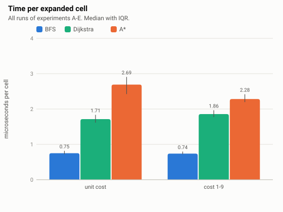

| algorithm | us per cell, unit cost | us per cell, cost 1-9 |
| --- | ---: | ---: |
| BFS | 0.75 | 0.74 |
| Dijkstra | 1.71 | 1.86 |
| A* | 2.69 | 2.28 |

## Heuristic accuracy

Accuracy 1 means the Manhattan distance equals the real remaining cost; with costs 1-9 it is about 1/5, and A* expands almost as much as Dijkstra.

## Measurement noise

| algorithm | median ms | IQR / median | min | max |
| --- | ---: | ---: | ---: | ---: |
| BFS | 26.57 | 17.0% | 23.61 | 57.93 |
| Dijkstra | 57.05 | 8.9% | 53.22 | 95.59 |
| A* | 5.68 | 19.5% | 5.45 | 10.35 |

## T. A* tie-breaking

| condition | algorithm | time ms, median [IQR] | expanded | of reachable | stale | max frontier | cost / optimal | us per cell |
| --- | --- | ---: | ---: | ---: | ---: | ---: | ---: | ---: |
| random 0% | larger g first | 1.16 [1.15-1.17] | 399 | 1% | 0 | 397 | 1.000 | 2.91 |
| random 0% | smaller g first | 80.80 [78.18-82.64] | 40,000 | 100% | 0 | 200 | 1.000 | 2.02 |
| random 0% | insertion order | 80.25 [77.87-84.62] | 40,000 | 100% | 0 | 200 | 1.000 | 2.01 |
| random 10% | larger g first | 6.05 [5.43-6.84] | 2,106 | 6% | 0 | 1,676 | 1.000 | 2.84 |
| random 10% | smaller g first | 65.94 [63.03-69.07] | 30,604 | 85% | 0 | 742 | 1.000 | 2.16 |
| random 10% | insertion order | 64.65 [61.52-69.25] | 30,604 | 85% | 0 | 742 | 1.000 | 2.13 |
| random 20% | larger g first | 6.84 [5.82-8.54] | 2,450 | 8% | 0 | 1,464 | 1.000 | 2.70 |
| random 20% | smaller g first | 43.63 [38.94-47.50] | 19,572 | 61% | 0 | 1,420 | 1.000 | 2.18 |
| random 20% | insertion order | 43.01 [38.17-46.33] | 19,572 | 61% | 0 | 1,420 | 1.000 | 2.11 |
| city | larger g first | 3.20 [2.17-5.40] | 1,506 | 15% | 0 | 156 | 1.000 | 1.96 |
| city | smaller g first | 7.66 [6.53-10.14] | 4,176 | 41% | 0 | 188 | 1.000 | 1.80 |
| city | insertion order | 7.43 [6.25-9.20] | 4,176 | 41% | 0 | 188 | 1.000 | 1.76 |
| random 20%, cost 1-9 | larger g first | 73.14 [70.35-76.72] | 31,897 | 100% | 1,794 | 366 | 1.000 | 2.29 |
| random 20%, cost 1-9 | smaller g first | 69.70 [67.21-72.75] | 31,898 | 100% | 868 | 350 | 1.000 | 2.18 |
| random 20%, cost 1-9 | insertion order | 68.74 [66.34-75.87] | 31,898 | 100% | 1,230 | 352 | 1.000 | 2.15 |

## W. Weighted A*

| condition | algorithm | time ms, median [IQR] | expanded | of reachable | stale | max frontier | cost / optimal | us per cell |
| --- | --- | ---: | ---: | ---: | ---: | ---: | ---: | ---: |
| random 20% | dijkstra | 53.61 [52.41-55.46] | 31,903 | 100% | 0 | 188 | 1.000 | 1.68 |
| random 20% | A* x1 | 6.83 [5.82-8.58] | 2,450 | 8% | 0 | 1,464 | 1.000 | 2.61 |
| random 20% | A* x1.5 | 1.86 [1.63-2.10] | 634 | 2% | 24 | 436 | 1.091 | 2.76 |
| random 20% | A* x2 | 1.58 [1.50-1.77] | 567 | 2% | 10 | 432 | 1.127 | 2.73 |
| random 20% | A* x3 | 1.49 [1.44-1.62] | 545 | 2% | 0 | 434 | 1.156 | 2.70 |
| random 20% | A* x5 | 1.46 [1.40-1.56] | 534 | 2% | 0 | 436 | 1.165 | 2.71 |
| random 20%, cost 1-9 | dijkstra | 59.49 [57.44-61.15] | 31,898 | 100% | 0 | 272 | 1.000 | 1.86 |
| random 20%, cost 1-9 | A* x1 | 71.76 [69.18-73.37] | 31,897 | 100% | 1,794 | 366 | 1.000 | 2.25 |
| random 20%, cost 1-9 | A* x1.5 | 74.52 [72.39-78.17] | 31,893 | 100% | 2,700 | 432 | 1.000 | 2.34 |
| random 20%, cost 1-9 | A* x2 | 77.06 [75.11-89.87] | 31,886 | 100% | 3,790 | 545 | 1.001 | 2.42 |
| random 20%, cost 1-9 | A* x3 | 70.33 [67.12-75.67] | 26,521 | 83% | 4,758 | 1,039 | 1.006 | 2.64 |
| random 20%, cost 1-9 | A* x5 | 1.68 [1.58-1.91] | 600 | 2% | 7 | 469 | 1.132 | 2.76 |
| terrain | dijkstra | 75.29 [73.34-80.23] | 40,000 | 100% | 0 | 330 | 1.000 | 1.89 |
| terrain | A* x1 | 91.26 [88.79-95.22] | 39,888 | 100% | 2,994 | 494 | 1.000 | 2.30 |
| terrain | A* x1.5 | 97.67 [93.53-103.87] | 39,492 | 99% | 5,029 | 593 | 1.000 | 2.49 |
| terrain | A* x2 | 99.20 [94.24-114.23] | 38,158 | 95% | 7,335 | 882 | 1.019 | 2.64 |
| terrain | A* x3 | 83.54 [73.76-102.77] | 28,876 | 72% | 9,828 | 1,728 | 1.071 | 2.88 |
| terrain | A* x5 | 4.98 [1.74-14.39] | 1,336 | 3% | 241 | 1,186 | 1.234 | 3.00 |
| U wall | dijkstra | 69.32 [68.70-71.59] | 38,919 | 98% | 0 | 239 | 1.000 | 1.78 |
| U wall | A* x1 | 22.56 [22.06-24.81] | 11,572 | 29% | 0 | 347 | 1.000 | 1.95 |
| U wall | A* x1.5 | 22.75 [22.52-23.71] | 11,012 | 28% | 0 | 347 | 1.000 | 2.07 |
| U wall | A* x2 | 22.28 [21.28-24.52] | 10,558 | 27% | 0 | 347 | 1.000 | 2.11 |
| U wall | A* x3 | 20.37 [20.29-22.78] | 10,052 | 25% | 0 | 347 | 1.000 | 2.03 |
| U wall | A* x5 | 19.45 [19.25-21.95] | 9,518 | 24% | 0 | 347 | 1.000 | 2.04 |
| city, cost 1-9 | dijkstra | 15.30 [14.96-16.20] | 10,225 | 100% | 0 | 94 | 1.000 | 1.51 |
| city, cost 1-9 | A* x1 | 17.49 [15.90-19.62] | 9,383 | 91% | 84 | 143 | 1.000 | 1.83 |
| city, cost 1-9 | A* x1.5 | 13.28 [10.82-16.71] | 6,381 | 62% | 66 | 136 | 1.008 | 1.87 |
| city, cost 1-9 | A* x2 | 6.37 [3.91-7.87] | 3,001 | 29% | 39 | 128 | 1.028 | 1.85 |
| city, cost 1-9 | A* x3 | 1.79 [1.61-2.87] | 929 | 9% | 8 | 106 | 1.148 | 1.86 |
| city, cost 1-9 | A* x5 | 1.54 [1.37-1.74] | 776 | 8% | 4 | 97 | 1.295 | 1.85 |

## H. heapq vs plain-Python heap

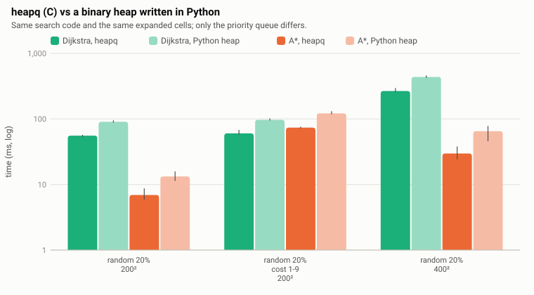

| condition | algorithm | heapq ms | Python heap ms | slower by |
| --- | ---: | ---: | ---: | ---: |
| random 20% 200² | Dijkstra | 54.88 | 92.56 | 1.69x |
| random 20% 200² | A* | 6.98 | 13.54 | 1.94x |
| random 20%, cost 1-9 200² | Dijkstra | 58.58 | 99.03 | 1.69x |
| random 20%, cost 1-9 200² | A* | 71.99 | 122.27 | 1.70x |
| random 20% 400² | Dijkstra | 265.27 | 441.18 | 1.66x |
| random 20% 400² | A* | 28.30 | 61.59 | 2.18x |

## BI. Bidirectional Dijkstra

| condition | algorithm | time ms, median [IQR] | expanded | of reachable | stale | max frontier | cost / optimal | us per cell |
| --- | --- | ---: | ---: | ---: | ---: | ---: | ---: | ---: |
| random 20% | Dijkstra | 54.29 [52.66-56.16] | 31,903 | 100% | 0 | 188 | 1.000 | 1.70 |
| random 20% | A* | 6.92 [5.60-8.53] | 2,450 | 8% | 0 | 1,464 | 1.000 | 2.67 |
| random 20% | Bidirectional | 58.37 [57.07-60.99] | 29,748 | 93% | 0 | 326 | 1.000 | 1.98 |
| random 20%, cost 1-9 | Dijkstra | 59.01 [56.26-63.88] | 31,898 | 100% | 0 | 272 | 1.000 | 1.85 |
| random 20%, cost 1-9 | A* | 72.94 [71.11-77.19] | 31,897 | 100% | 1,794 | 366 | 1.000 | 2.28 |
| random 20%, cost 1-9 | Bidirectional | 55.60 [53.92-59.11] | 25,286 | 79% | 2,011 | 429 | 1.000 | 2.20 |
| random 20%, random ends | Dijkstra | 44.40 [31.39-49.89] | 24,459 | 77% | 0 | 212 | 1.000 | 1.74 |
| random 20%, random ends | A* | 2.48 [0.75-5.18] | 802 | 3% | 0 | 302 | 1.000 | 3.02 |
| random 20%, random ends | Bidirectional | 31.54 [20.05-39.43] | 12,408 | 39% | 0 | 329 | 1.000 | 2.06 |
| random 20%, cost 1-9, random ends | Dijkstra | 47.95 [35.72-55.99] | 25,232 | 79% | 0 | 284 | 1.000 | 1.96 |
| random 20%, cost 1-9, random ends | A* | 45.65 [23.67-63.60] | 17,848 | 56% | 1,092 | 336 | 1.000 | 2.39 |
| random 20%, cost 1-9, random ends | Bidirectional | 32.71 [19.77-48.92] | 12,486 | 39% | 1,564 | 428 | 1.000 | 2.24 |
| maze | Dijkstra | 15.47 [11.08-16.65] | 8,953 | 45% | 0 | 12 | 1.000 | 1.34 |
| maze | A* | 16.30 [13.09-20.26] | 8,832 | 44% | 0 | 11 | 1.000 | 1.63 |
| maze | Bidirectional | 16.61 [14.18-20.48] | 8,958 | 45% | 0 | 20 | 1.000 | 1.65 |
| maze + loops | Dijkstra | 32.98 [31.32-35.45] | 20,862 | 100% | 0 | 106 | 1.000 | 1.58 |
| maze + loops | A* | 28.42 [25.33-37.70] | 14,346 | 68% | 572 | 227 | 1.000 | 2.00 |
| maze + loops | Bidirectional | 26.55 [24.87-29.20] | 14,500 | 69% | 0 | 146 | 1.000 | 1.79 |
| no path | Dijkstra | 55.39 [52.74-60.02] | 31,900 | 100% | 0 | 188 | - | 1.74 |
| no path | A* | 91.92 [88.69-97.86] | 31,900 | 100% | 12,330 | 10,513 | - | 2.89 |
| no path | Bidirectional | 0.02 [0.02-0.02] | 2 | 0% | 0 | 3 | - | 8.60 |
| U wall | Dijkstra | 68.91 [66.79-72.21] | 38,919 | 98% | 0 | 239 | 1.000 | 1.77 |
| U wall | A* | 23.74 [23.38-26.31] | 11,572 | 29% | 0 | 347 | 1.000 | 2.05 |
| U wall | Bidirectional | 63.74 [61.82-69.56] | 29,129 | 73% | 0 | 357 | 1.000 | 2.19 |
| terrain | Dijkstra | 75.83 [73.64-78.72] | 40,000 | 100% | 0 | 330 | 1.000 | 1.90 |
| terrain | A* | 93.72 [90.78-101.93] | 39,888 | 100% | 2,994 | 494 | 1.000 | 2.35 |
| terrain | Bidirectional | 63.48 [60.46-71.31] | 28,242 | 71% | 335 | 484 | 1.000 | 2.22 |
| city, cost 1-9 | Dijkstra | 15.47 [15.11-16.72] | 10,225 | 100% | 0 | 94 | 1.000 | 1.51 |
| city, cost 1-9 | A* | 17.68 [14.69-19.06] | 9,383 | 91% | 84 | 143 | 1.000 | 1.87 |
| city, cost 1-9 | Bidirectional | 12.31 [10.60-14.24] | 6,263 | 61% | 10 | 124 | 1.000 | 1.78 |

## O. 8-directional moves and Jump Point Search

Costs are in 8-direction units (straight step 10, diagonal 14). JPS puts only jump points on the heap but scans many cells in between.

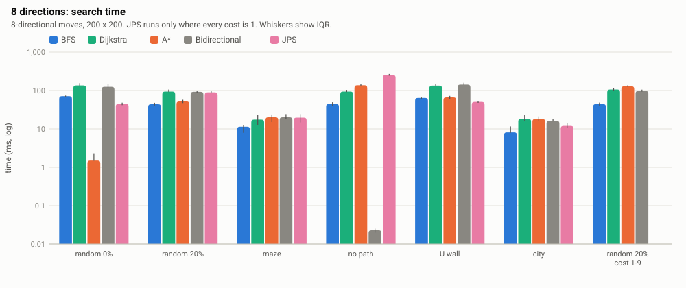

| condition | JPS jump points | JPS cells scanned | A* expanded | JPS ms | A* ms |
| --- | ---: | ---: | ---: | ---: | ---: |
| random 0% | 2 | 39,999 | 200 | 41.26 | 1.47 |
| random 20% | 6,512 | 51,430 | 11,522 | 82.69 | 47.20 |
| maze | 2,644 | 8,843 | 8,840 | 16.87 | 21.61 |
| no path | 18,492 | 146,092 | 31,900 | 233.84 | 126.91 |
| U wall | 7 | 43,563 | 10,224 | 44.91 | 60.05 |
| city | 600 | 9,608 | 7,428 | 10.73 | 15.60 |

| condition | algorithm | time ms, median [IQR] | expanded | of reachable | stale | max frontier | cost / optimal | us per cell |
| --- | --- | ---: | ---: | ---: | ---: | ---: | ---: | ---: |
| random 0% | BFS | 63.95 [61.98-70.28] | 40,000 | 100% | 0 | 399 | 1.000 | 1.60 |
| random 0% | Dijkstra | 122.97 [118.20-131.93] | 40,000 | 100% | 0 | 399 | 1.000 | 3.07 |
| random 0% | A* | 1.47 [1.45-1.49] | 200 | 0% | 0 | 795 | 1.000 | 7.35 |
| random 0% | Bidirectional | 112.49 [109.01-115.83] | 27,960 | 70% | 0 | 562 | 1.000 | 4.02 |
| random 0% | JPS | 41.26 [40.79-42.83] | 2 | 0% | 0 | 1 | 1.000 | 20631.72 |
| random 20% | BFS | 40.29 [39.72-43.19] | 31,901 | 100% | 0 | 288 | 1.001 | 1.26 |
| random 20% | Dijkstra | 86.00 [83.33-88.83] | 31,902 | 100% | 506 | 291 | 1.000 | 2.70 |
| random 20% | A* | 47.20 [44.30-51.83] | 11,522 | 36% | 4,870 | 938 | 1.000 | 4.07 |
| random 20% | Bidirectional | 84.88 [82.45-92.22] | 25,408 | 80% | 408 | 434 | 1.000 | 3.35 |
| random 20% | JPS | 82.69 [80.27-86.64] | 6,512 | 20% | 1,344 | 624 | 1.000 | 12.58 |
| maze | BFS | 9.43 [7.61-11.91] | 8,953 | 45% | 0 | 12 | 1.000 | 0.96 |
| maze | Dijkstra | 14.91 [11.89-17.95] | 8,953 | 45% | 0 | 12 | 1.000 | 1.46 |
| maze | A* | 21.61 [15.08-23.74] | 8,840 | 44% | 0 | 12 | 1.000 | 1.86 |
| maze | Bidirectional | 17.69 [16.20-22.12] | 8,958 | 45% | 0 | 20 | 1.000 | 1.88 |
| maze | JPS | 16.87 [13.71-19.86] | 2,644 | 13% | 0 | 8 | 1.000 | 5.74 |
| no path | BFS | 39.75 [39.17-42.38] | 31,900 | 100% | 0 | 288 | - | 1.25 |
| no path | Dijkstra | 85.28 [83.09-90.38] | 31,900 | 100% | 506 | 291 | - | 2.68 |
| no path | A* | 126.91 [122.14-138.28] | 31,900 | 100% | 13,744 | 938 | - | 3.97 |
| no path | Bidirectional | 0.02 [0.02-0.02] | 2 | 0% | 0 | 4 | - | 9.47 |
| no path | JPS | 233.84 [225.72-251.13] | 18,492 | 58% | 4,467 | 648 | - | 12.62 |
| U wall | BFS | 56.77 [55.63-58.86] | 35,680 | 90% | 0 | 414 | 1.000 | 1.59 |
| U wall | Dijkstra | 121.73 [118.28-128.56] | 37,562 | 94% | 0 | 436 | 1.000 | 3.24 |
| U wall | A* | 60.05 [57.41-67.82] | 10,224 | 26% | 15,865 | 1,375 | 1.000 | 5.87 |
| U wall | Bidirectional | 129.09 [125.67-135.66] | 29,412 | 74% | 0 | 629 | 1.000 | 4.39 |
| U wall | JPS | 44.91 [44.37-46.71] | 7 | 0% | 0 | 3 | 1.000 | 6415.90 |
| city | BFS | 7.79 [7.70-7.96] | 10,232 | 100% | 0 | 74 | 1.000 | 0.76 |
| city | Dijkstra | 16.03 [15.72-16.76] | 10,232 | 100% | 0 | 74 | 1.000 | 1.56 |
| city | A* | 15.60 [14.25-17.75] | 7,428 | 73% | 180 | 120 | 1.000 | 2.08 |
| city | Bidirectional | 15.75 [15.23-16.74] | 8,212 | 80% | 0 | 120 | 1.000 | 1.91 |
| city | JPS | 10.73 [10.07-11.79] | 600 | 6% | 29 | 71 | 1.000 | 17.85 |
| random 20%, cost 1-9 | BFS | 41.00 [39.54-43.64] | 31,901 | 100% | 0 | 288 | 1.436 | 1.28 |
| random 20%, cost 1-9 | Dijkstra | 94.42 [92.43-99.46] | 31,896 | 100% | 4,930 | 481 | 1.000 | 2.96 |
| random 20%, cost 1-9 | A* | 117.71 [113.91-122.96] | 31,876 | 100% | 6,084 | 598 | 1.000 | 3.68 |
| random 20%, cost 1-9 | Bidirectional | 89.15 [86.89-96.03] | 23,792 | 75% | 5,872 | 697 | 1.000 | 3.74 |

## J. Traffic jams

| condition | algorithm | time ms, median [IQR] | expanded | of reachable | stale | max frontier | cost / optimal | us per cell |
| --- | --- | ---: | ---: | ---: | ---: | ---: | ---: | ---: |
| jams 0% | BFS | 6.77 [6.70-6.88] | 10,232 | 100% | 0 | 74 | 1.000 | 0.66 |
| jams 0% | Dijkstra | 14.64 [14.51-15.10] | 10,232 | 100% | 0 | 74 | 1.000 | 1.43 |
| jams 0% | A* | 2.90 [2.57-5.00] | 1,506 | 15% | 0 | 156 | 1.000 | 1.94 |
| jams 0% | Bidirectional | 14.00 [13.58-15.33] | 8,212 | 80% | 0 | 120 | 1.000 | 1.69 |
| jams 1% | BFS | 6.78 [6.71-6.92] | 10,232 | 100% | 0 | 74 | 1.050 | 0.67 |
| jams 1% | Dijkstra | 14.77 [14.65-15.31] | 10,228 | 100% | 0 | 74 | 1.000 | 1.44 |
| jams 1% | A* | 5.11 [2.44-8.21] | 2,728 | 27% | 62 | 180 | 1.000 | 1.94 |
| jams 1% | Bidirectional | 13.36 [12.73-14.42] | 7,820 | 76% | 5 | 125 | 1.000 | 1.71 |
| jams 2% | BFS | 6.83 [6.74-6.94] | 10,232 | 100% | 0 | 74 | 1.097 | 0.67 |
| jams 2% | Dijkstra | 14.92 [14.76-15.12] | 10,232 | 100% | 0 | 78 | 1.000 | 1.46 |
| jams 2% | A* | 6.95 [2.56-8.99] | 3,558 | 35% | 74 | 165 | 1.000 | 1.92 |
| jams 2% | Bidirectional | 13.29 [12.55-14.10] | 7,662 | 75% | 12 | 122 | 1.000 | 1.70 |
| jams 5% | BFS | 6.77 [6.70-6.86] | 10,232 | 100% | 0 | 74 | 1.194 | 0.66 |
| jams 5% | Dijkstra | 15.03 [14.82-15.51] | 10,218 | 100% | 0 | 78 | 1.000 | 1.47 |
| jams 5% | A* | 10.28 [7.33-14.70] | 5,313 | 52% | 100 | 199 | 1.000 | 1.91 |
| jams 5% | Bidirectional | 12.71 [12.18-13.79] | 7,182 | 70% | 22 | 127 | 1.000 | 1.72 |
| jams 10% | BFS | 6.77 [6.69-6.90] | 10,232 | 100% | 0 | 74 | 1.244 | 0.66 |
| jams 10% | Dijkstra | 15.11 [14.85-15.84] | 10,210 | 100% | 0 | 78 | 1.000 | 1.48 |
| jams 10% | A* | 15.78 [11.59-18.01] | 7,939 | 77% | 124 | 159 | 1.000 | 1.90 |
| jams 10% | Bidirectional | 12.49 [10.97-13.88] | 7,043 | 69% | 34 | 114 | 1.000 | 1.74 |
| jams 20% | BFS | 6.83 [6.74-6.95] | 10,232 | 100% | 0 | 74 | 1.204 | 0.67 |
| jams 20% | Dijkstra | 15.30 [15.08-15.51] | 10,227 | 100% | 0 | 77 | 1.000 | 1.50 |
| jams 20% | A* | 18.47 [17.85-19.22] | 9,864 | 98% | 122 | 114 | 1.000 | 1.86 |
| jams 20% | Bidirectional | 13.01 [11.94-13.94] | 7,098 | 69% | 42 | 117 | 1.000 | 1.76 |
| jams 30% | BFS | 6.77 [6.69-6.88] | 10,232 | 100% | 0 | 74 | 1.199 | 0.66 |
| jams 30% | Dijkstra | 15.25 [15.04-15.61] | 10,225 | 100% | 0 | 74 | 1.000 | 1.49 |
| jams 30% | A* | 18.63 [18.15-19.45] | 10,026 | 98% | 94 | 104 | 1.000 | 1.85 |
| jams 30% | Bidirectional | 13.04 [11.93-14.21] | 7,116 | 70% | 48 | 118 | 1.000 | 1.77 |
| jams 50% | BFS | 6.79 [6.73-6.88] | 10,232 | 100% | 0 | 74 | 1.139 | 0.66 |
| jams 50% | Dijkstra | 15.25 [15.04-15.91] | 10,218 | 100% | 0 | 71 | 1.000 | 1.49 |
| jams 50% | A* | 18.52 [18.12-18.86] | 10,152 | 99% | 74 | 82 | 1.000 | 1.82 |
| jams 50% | Bidirectional | 13.25 [11.74-13.84] | 7,320 | 71% | 36 | 111 | 1.000 | 1.76 |

## HQ. Heuristic quality: Manhattan vs landmarks, measured with the accuracy ruler

Accuracy = mean over all cells that can reach the goal of (estimate / real remaining cost). The ruler h = k x real remaining cost needs the answer in advance, so it is a measuring tool, not a competitor. Random start and goal: landmarks are computed once per map and serve any query. Queries to pay off = precomputation time / time saved per query compared with Dijkstra. Precomputation fitted as a + b x landmarks: random 20%, cost 1-9: 59 ms + 44.2 ms per landmark (R² 1.000), maze: 47 ms + 20.0 ms per landmark (R² 0.995), city, jams 20%: 23 ms + 13.4 ms per landmark (R² 1.000).

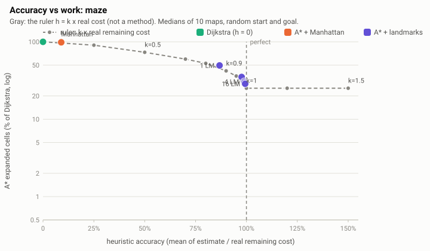

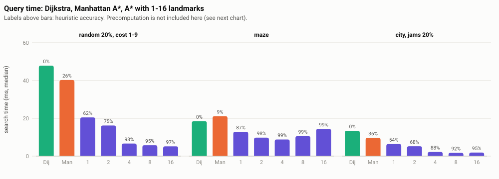

| map | heuristic | accuracy | cells vs Dijkstra | time ms | precompute ms | queries to pay off (vs Dijkstra) | cost / optimal |
| --- | --- | ---: | ---: | ---: | ---: | ---: | ---: |
| random 20%, cost 1-9 | Dijkstra | 0% | 100.0% | 51.08 | - | - | 1.000 |
| random 20%, cost 1-9 | A* + Manhattan | 26% | 74.2% | 44.95 | - | - | 1.000 |
| random 20%, cost 1-9 | A* + 1 landmarks | 62% | 42.9% | 21.39 | 107.0 | 3.6 | 1.000 |
| random 20%, cost 1-9 | A* + 2 landmarks | 75% | 24.7% | 16.26 | 149.1 | 4.3 | 1.000 |
| random 20%, cost 1-9 | A* + 4 landmarks | 93% | 8.1% | 6.49 | 232.6 | 5.2 | 1.000 |
| random 20%, cost 1-9 | A* + 8 landmarks | 95% | 5.6% | 5.48 | 405.8 | 8.9 | 1.000 |
| random 20%, cost 1-9 | A* + 16 landmarks | 97% | 2.9% | 5.08 | 769.6 | 16.7 | 1.000 |
| random 20%, cost 1-9 | ruler k = 0.25 | 25% | 75.6% | 41.35 | 41.7 | - | 1.000 |
| random 20%, cost 1-9 | ruler k = 0.5 | 50% | 44.1% | 25.68 | 40.8 | - | 1.000 |
| random 20%, cost 1-9 | ruler k = 0.7 | 70% | 28.0% | 16.47 | 41.3 | - | 1.000 |
| random 20%, cost 1-9 | ruler k = 0.8 | 80% | 20.3% | 12.27 | 42.8 | - | 1.000 |
| random 20%, cost 1-9 | ruler k = 0.9 | 90% | 11.0% | 6.97 | 41.7 | - | 1.000 |
| random 20%, cost 1-9 | ruler k = 0.95 | 95% | 5.8% | 3.94 | 39.7 | - | 1.000 |
| random 20%, cost 1-9 | ruler k = 1 | 100% | 0.8% | 0.59 | 40.3 | - | 1.000 |
| random 20%, cost 1-9 | ruler k = 1.2 | 120% | 0.8% | 0.59 | 39.0 | - | 1.000 |
| random 20%, cost 1-9 | ruler k = 1.5 | 150% | 0.8% | 0.58 | 39.8 | - | 1.003 |
| maze | Dijkstra | 0% | 100.0% | 19.73 | - | - | 1.000 |
| maze | A* + Manhattan | 9% | 98.6% | 22.61 | - | - | 1.000 |
| maze | A* + 1 landmarks | 87% | 49.6% | 13.76 | 74.5 | 12.5 | 1.000 |
| maze | A* + 2 landmarks | 98% | 35.2% | 9.07 | 75.0 | 7.0 | 1.000 |
| maze | A* + 4 landmarks | 99% | 30.6% | 8.52 | 136.1 | 12.1 | 1.000 |
| maze | A* + 8 landmarks | 99% | 29.5% | 10.96 | 201.3 | 23.0 | 1.000 |
| maze | A* + 16 landmarks | 99% | 28.7% | 13.44 | 368.5 | 58.6 | 1.000 |
| maze | ruler k = 0.25 | 25% | 90.5% | 18.86 | 20.7 | - | 1.000 |
| maze | ruler k = 0.5 | 50% | 73.3% | 14.32 | 19.8 | - | 1.000 |
| maze | ruler k = 0.7 | 70% | 59.9% | 11.46 | 19.6 | - | 1.000 |
| maze | ruler k = 0.8 | 80% | 52.7% | 10.05 | 19.4 | - | 1.000 |
| maze | ruler k = 0.9 | 90% | 42.1% | 7.93 | 19.7 | - | 1.000 |
| maze | ruler k = 0.95 | 95% | 36.2% | 7.15 | 19.5 | - | 1.000 |
| maze | ruler k = 1 | 100% | 25.2% | 5.09 | 20.9 | - | 1.000 |
| maze | ruler k = 1.2 | 120% | 25.2% | 6.15 | 19.5 | - | 1.000 |
| maze | ruler k = 1.5 | 150% | 25.2% | 4.98 | 20.2 | - | 1.000 |
| city, jams 20% | Dijkstra | 0% | 100.0% | 13.29 | - | - | 1.000 |
| city, jams 20% | A* + Manhattan | 36% | 58.7% | 9.67 | - | - | 1.000 |
| city, jams 20% | A* + 1 landmarks | 54% | 49.5% | 6.50 | 36.4 | 5.4 | 1.000 |
| city, jams 20% | A* + 2 landmarks | 68% | 31.6% | 4.80 | 48.7 | 5.7 | 1.000 |
| city, jams 20% | A* + 4 landmarks | 88% | 10.4% | 2.33 | 76.0 | 6.9 | 1.000 |
| city, jams 20% | A* + 8 landmarks | 92% | 6.6% | 1.59 | 129.4 | 11.1 | 1.000 |
| city, jams 20% | A* + 16 landmarks | 95% | 4.6% | 1.80 | 236.3 | 20.6 | 1.000 |
| city, jams 20% | ruler k = 0.25 | 25% | 76.8% | 12.45 | 12.4 | - | 1.000 |
| city, jams 20% | ruler k = 0.5 | 50% | 44.2% | 7.39 | 12.2 | - | 1.000 |
| city, jams 20% | ruler k = 0.7 | 70% | 26.5% | 4.19 | 12.2 | - | 1.000 |
| city, jams 20% | ruler k = 0.8 | 80% | 18.5% | 2.60 | 12.4 | - | 1.000 |
| city, jams 20% | ruler k = 0.9 | 90% | 9.9% | 1.50 | 12.5 | - | 1.000 |
| city, jams 20% | ruler k = 0.95 | 95% | 6.8% | 0.98 | 12.7 | - | 1.000 |
| city, jams 20% | ruler k = 1 | 100% | 3.2% | 0.49 | 12.6 | - | 1.000 |
| city, jams 20% | ruler k = 1.2 | 120% | 3.2% | 0.48 | 12.6 | - | 1.000 |
| city, jams 20% | ruler k = 1.5 | 150% | 3.2% | 0.46 | 12.4 | - | 1.000 |

## DY. Dynamic traffic: old landmarks vs recomputed

The landmarks are measured on the jammed city, then the traffic changes and the same landmarks are used without measuring again (old), or measured again on the new map (recomputed). Jams +x%: x% of free road cells become jammed (costs only rise). Jams cleared x%: x% of jammed cells become free (some costs fall). Old landmarks are checked to be optimal in every run where costs only rose. Queries to pay off recomputing = precomputation time / time saved per query compared with the old landmarks.

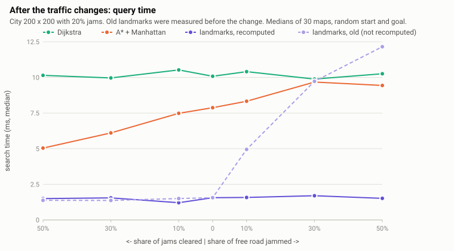

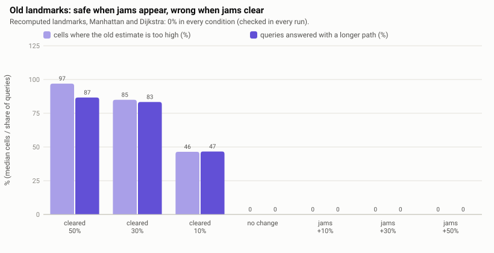

| change | method | time ms | cells | accuracy | cells overestimated | queries with a longer path | worst extra cost | precompute after the change (ms) | queries to pay off recomputing (vs old) |
| --- | --- | ---: | ---: | ---: | ---: | ---: | ---: | ---: | ---: |
| jams cleared 50% | Dijkstra | 10.15 | 6,788 | - | 0% | 0% | 0 | - | - |
| jams cleared 50% | A* + Manhattan | 5.04 | 2,614 | 54% | 0% | 0% | 0 | - | - |
| jams cleared 50% | landmarks, recomputed | 1.50 | 444 | 91% | 0% | 0% | 0 | 131 | never (old is as fast) |
| jams cleared 50% | landmarks, old (not recomputed) | 1.38 | 424 | 136% | 97% | 87% | +18.5% | 0 (already paid) | - |
| jams cleared 30% | Dijkstra | 9.97 | 6,582 | - | 0% | 0% | 0 | - | - |
| jams cleared 30% | A* + Manhattan | 6.11 | 3,282 | 46% | 0% | 0% | 0 | - | - |
| jams cleared 30% | landmarks, recomputed | 1.55 | 503 | 90% | 0% | 0% | 0 | 131 | never (old is as fast) |
| jams cleared 30% | landmarks, old (not recomputed) | 1.37 | 422 | 113% | 85% | 83% | +11.5% | 0 (already paid) | - |
| jams cleared 10% | Dijkstra | 10.53 | 6,404 | - | 0% | 0% | 0 | - | - |
| jams cleared 10% | A* + Manhattan | 7.48 | 3,872 | 39% | 0% | 0% | 0 | - | - |
| jams cleared 10% | landmarks, recomputed | 1.21 | 391 | 91% | 0% | 0% | 0 | 129 | 440 |
| jams cleared 10% | landmarks, old (not recomputed) | 1.50 | 491 | 98% | 46% | 47% | +4.6% | 0 (already paid) | - |
| no change | Dijkstra | 10.08 | 6,710 | - | 0% | 0% | 0 | - | - |
| no change | A* + Manhattan | 7.88 | 4,198 | 36% | 0% | 0% | 0 | - | - |
| no change | landmarks, recomputed | 1.56 | 500 | 91% | 0% | 0% | 0 | 130 | - |
| no change | landmarks, old (not recomputed) | 1.56 | 500 | 91% | 0% | 0% | 0 | 0 (already paid) | - |
| jams +10% | Dijkstra | 10.41 | 6,644 | - | 0% | 0% | 0 | - | - |
| jams +10% | A* + Manhattan | 8.33 | 4,418 | 29% | 0% | 0% | 0 | - | - |
| jams +10% | landmarks, recomputed | 1.58 | 514 | 91% | 0% | 0% | 0 | 130 | 39 |
| jams +10% | landmarks, old (not recomputed) | 4.95 | 1,600 | 72% | 0% | 0% | 0 | 0 (already paid) | - |
| jams +30% | Dijkstra | 9.89 | 6,574 | - | 0% | 0% | 0 | - | - |
| jams +30% | A* + Manhattan | 9.68 | 5,099 | 21% | 0% | 0% | 0 | - | - |
| jams +30% | landmarks, recomputed | 1.70 | 550 | 92% | 0% | 0% | 0 | 129 | 16 |
| jams +30% | landmarks, old (not recomputed) | 9.73 | 3,176 | 51% | 0% | 0% | 0 | 0 (already paid) | - |
| jams +50% | Dijkstra | 10.26 | 6,549 | - | 0% | 0% | 0 | - | - |
| jams +50% | A* + Manhattan | 9.44 | 5,152 | 16% | 0% | 0% | 0 | - | - |
| jams +50% | landmarks, recomputed | 1.51 | 493 | 92% | 0% | 0% | 0 | 128 | 12 |
| jams +50% | landmarks, old (not recomputed) | 12.16 | 4,052 | 39% | 0% | 0% | 0 | 0 (already paid) | - |

## LP. Landmark placement

farthest: each landmark is the cell farthest (by path cost) from those already chosen. corners: cells nearest the map corners, then edge midpoints. random: seeded random cells.

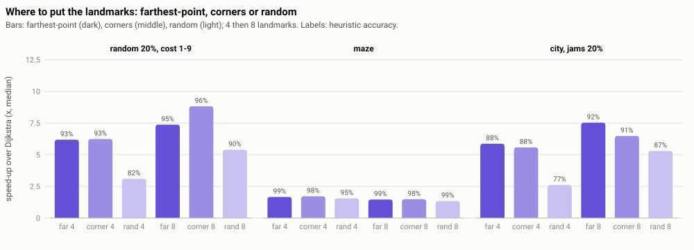

| map | landmarks | placement | accuracy | cells | time ms | speed-up over Dijkstra |
| --- | ---: | --- | ---: | ---: | ---: | ---: |
| random 20%, cost 1-9 | 4 | farthest | 93% | 1,676 | 6.70 | 6.2x |
| random 20%, cost 1-9 | 4 | corners | 93% | 1,684 | 6.79 | 6.2x |
| random 20%, cost 1-9 | 4 | random | 82% | 3,240 | 11.65 | 3.1x |
| random 20%, cost 1-9 | 8 | farthest | 95% | 1,122 | 5.43 | 7.4x |
| random 20%, cost 1-9 | 8 | corners | 96% | 1,132 | 5.46 | 8.8x |
| random 20%, cost 1-9 | 8 | random | 90% | 1,592 | 7.44 | 5.4x |
| maze | 4 | farthest | 99% | 3,194 | 8.45 | 1.7x |
| maze | 4 | corners | 98% | 4,105 | 10.79 | 1.7x |
| maze | 4 | random | 95% | 3,666 | 9.77 | 1.6x |
| maze | 8 | farthest | 99% | 3,194 | 11.10 | 1.5x |
| maze | 8 | corners | 98% | 3,679 | 12.21 | 1.5x |
| maze | 8 | random | 99% | 3,169 | 10.23 | 1.4x |
| city, jams 20% | 4 | farthest | 88% | 753 | 2.01 | 5.9x |
| city, jams 20% | 4 | corners | 88% | 660 | 1.79 | 5.6x |
| city, jams 20% | 4 | random | 77% | 1,778 | 4.39 | 2.6x |
| city, jams 20% | 8 | farthest | 92% | 470 | 1.55 | 7.5x |
| city, jams 20% | 8 | corners | 91% | 506 | 1.65 | 6.5x |
| city, jams 20% | 8 | random | 87% | 606 | 1.88 | 5.3x |

## RM0. How much the Songdo map changes over the day (traffic model)

Same start/goal pairs as RM, fastest route at each hour compared with the night (free flow).

| hour | average segment vs night | typical trip vs night | slowest trip vs night | fastest route changed | keep night route: typical / worst extra |
| --- | ---: | ---: | ---: | ---: | ---: |
| 0h | x1.00 | x1.00 | x1.00 | 0% | +0.0% / +0.0% |
| 1h | x1.00 | x1.00 | x1.00 | 0% | +0.0% / +0.0% |
| 2h | x1.00 | x1.00 | x1.00 | 0% | +0.0% / +0.0% |
| 3h | x1.00 | x1.00 | x1.00 | 0% | +0.0% / +0.0% |
| 4h | x1.00 | x1.00 | x1.00 | 0% | +0.0% / +0.0% |
| 5h | x1.01 | x1.02 | x1.03 | 0% | +0.0% / +0.0% |
| 6h | x1.11 | x1.14 | x1.23 | 20% | +0.0% / +2.5% |
| 7h | x1.37 | x1.48 | x1.80 | 60% | +0.3% / +5.8% |
| 8h | x1.55 | x1.70 | x2.17 | 63% | +1.0% / +7.8% |
| 9h | x1.37 | x1.47 | x1.79 | 53% | +0.2% / +5.6% |
| 10h | x1.19 | x1.26 | x1.41 | 37% | +0.0% / +4.4% |
| 11h | x1.19 | x1.26 | x1.41 | 40% | +0.0% / +5.0% |
| 12h | x1.19 | x1.26 | x1.42 | 40% | +0.0% / +4.2% |
| 13h | x1.19 | x1.26 | x1.42 | 33% | +0.0% / +4.1% |
| 14h | x1.19 | x1.27 | x1.41 | 40% | +0.0% / +5.0% |
| 15h | x1.19 | x1.27 | x1.41 | 33% | +0.0% / +4.9% |
| 16h | x1.19 | x1.27 | x1.41 | 37% | +0.0% / +5.0% |
| 17h | x1.31 | x1.43 | x1.68 | 53% | +0.2% / +6.9% |
| 18h | x1.52 | x1.72 | x2.22 | 67% | +1.5% / +12.8% |
| 19h | x1.52 | x1.72 | x2.23 | 70% | +1.3% / +11.4% |
| 20h | x1.31 | x1.43 | x1.67 | 50% | +0.0% / +8.2% |
| 21h | x1.11 | x1.16 | x1.24 | 23% | +0.0% / +2.6% |
| 22h | x1.02 | x1.03 | x1.06 | 3% | +0.0% / +0.2% |
| 23h | x1.00 | x1.00 | x1.00 | 0% | +0.0% / +0.0% |

## RM. Real road map (Songdo, OpenStreetMap) over the day

Map data (c) OpenStreetMap contributors, ODbL 1.0 (data/songdo_roads.json). Edge cost = travel time in tenths of a second at that hour. The traffic is a model (src/roads.py), not measured traffic. The straight-line heuristic divides the great-circle distance by the fastest free-flow speed. Landmarks (8) are measured once per hour and reused by all queries of that hour. Night landmarks are checked to be optimal in every run.

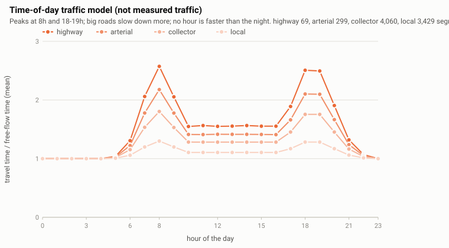

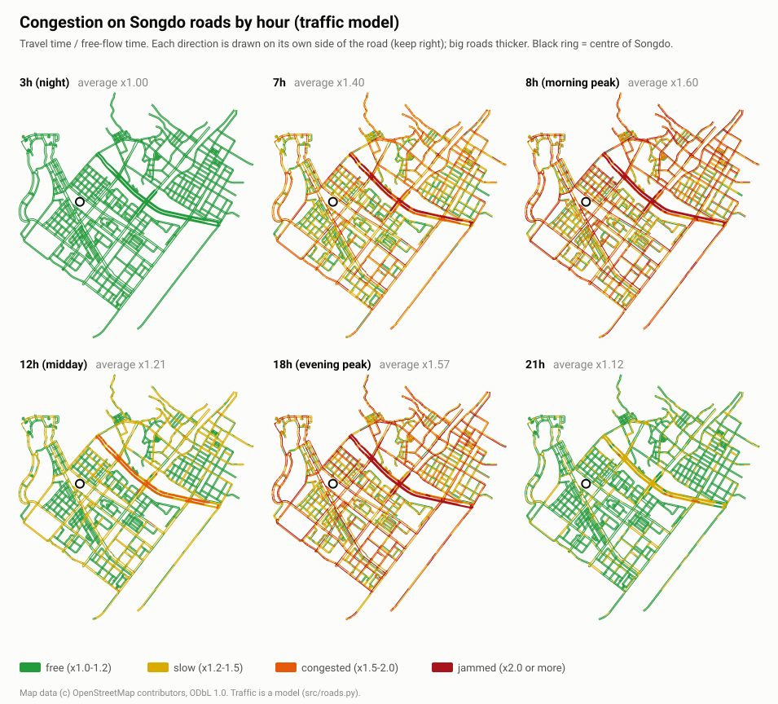

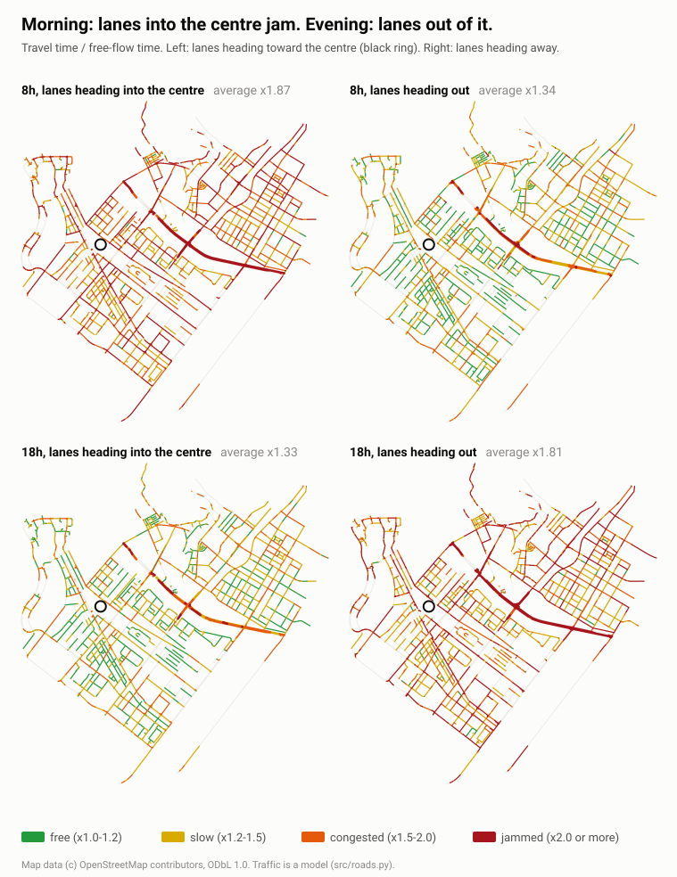

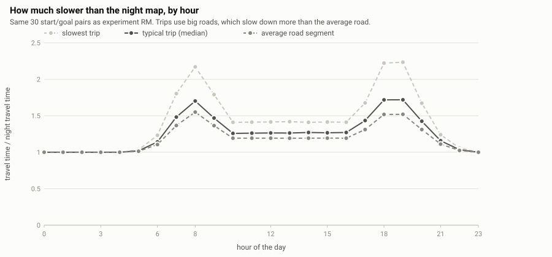

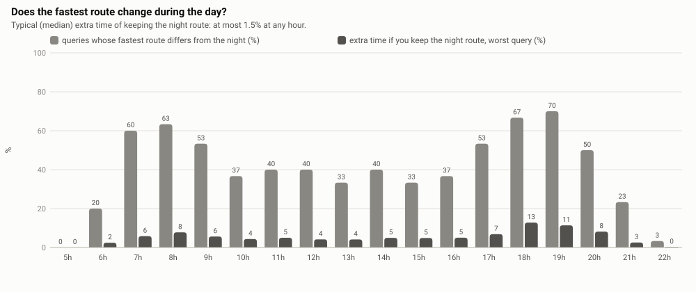

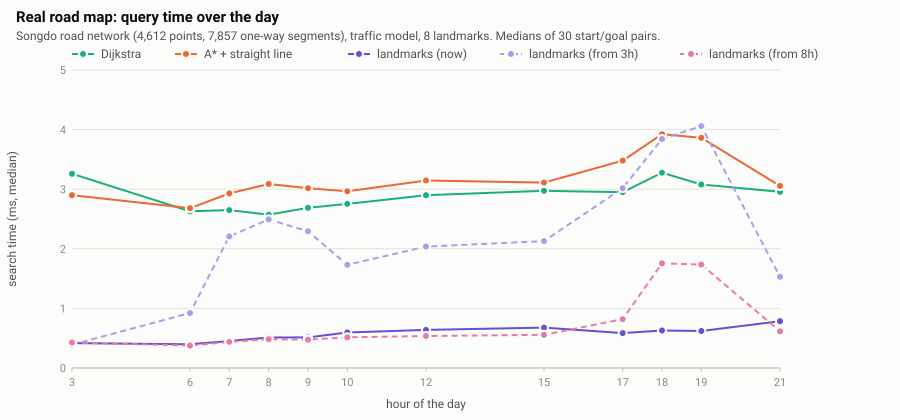

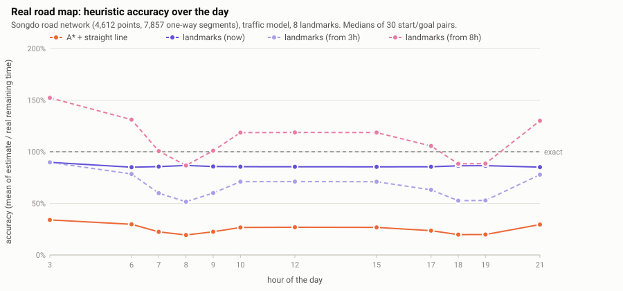

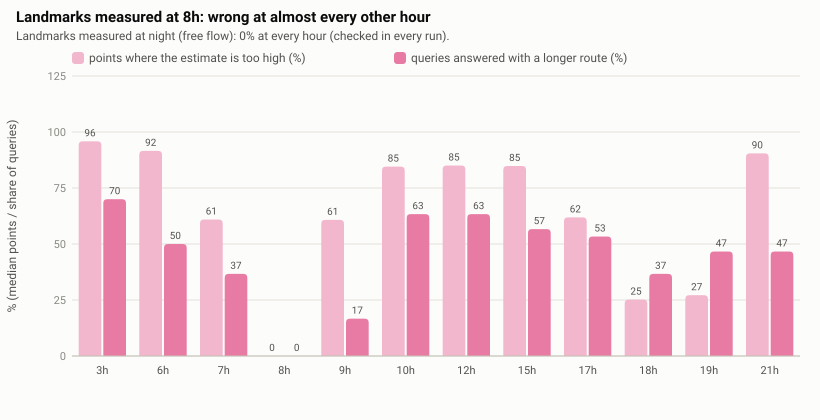

| hour | method | time ms | points expanded | accuracy | points overestimated | queries with a longer route | worst extra time | landmark precompute ms |
| --- | --- | ---: | ---: | ---: | ---: | ---: | ---: | ---: |
| 3h | Dijkstra | 3.26 | 2,296 | - | 0% | 0% | 0 | - |
| 3h | A* + straight line | 2.90 | 1,208 | 34% | 0% | 0% | 0 | - |
| 3h | landmarks measured this hour | 0.42 | 101 | 90% | 0% | 0% | 0 | 125 |
| 3h | landmarks measured at night (3h) | 0.39 | 101 | 90% | 0% | 0% | 0 | 125 |
| 3h | landmarks measured at 8h | 0.43 | 109 | 152% | 96% | 70% | +18.9% | 107 |
| 6h | Dijkstra | 2.63 | 2,298 | - | 0% | 0% | 0 | - |
| 6h | A* + straight line | 2.68 | 1,312 | 30% | 0% | 0% | 0 | - |
| 6h | landmarks measured this hour | 0.40 | 102 | 89% | 0% | 0% | 0 | 46 |
| 6h | landmarks measured at night (3h) | 0.92 | 290 | 79% | 0% | 0% | 0 | 125 |
| 6h | landmarks measured at 8h | 0.38 | 102 | 133% | 92% | 50% | +15.2% | 107 |
| 7h | Dijkstra | 2.65 | 2,244 | - | 0% | 0% | 0 | - |
| 7h | A* + straight line | 2.93 | 1,417 | 22% | 0% | 0% | 0 | - |
| 7h | landmarks measured this hour | 0.45 | 124 | 89% | 0% | 0% | 0 | 45 |
| 7h | landmarks measured at night (3h) | 2.21 | 704 | 62% | 0% | 0% | 0 | 125 |
| 7h | landmarks measured at 8h | 0.44 | 108 | 102% | 61% | 37% | +4.3% | 107 |
| 8h | Dijkstra | 2.57 | 2,196 | - | 0% | 0% | 0 | - |
| 8h | A* + straight line | 3.09 | 1,487 | 20% | 0% | 0% | 0 | - |
| 8h | landmarks measured this hour | 0.51 | 118 | 86% | 0% | 0% | 0 | 107 |
| 8h | landmarks measured at night (3h) | 2.49 | 780 | 54% | 0% | 0% | 0 | 125 |
| 8h | landmarks measured at 8h | 0.48 | 118 | 86% | 0% | 0% | 0 | 107 |
| 9h | Dijkstra | 2.69 | 2,238 | - | 0% | 0% | 0 | - |
| 9h | A* + straight line | 3.02 | 1,412 | 22% | 0% | 0% | 0 | - |
| 9h | landmarks measured this hour | 0.51 | 110 | 89% | 0% | 0% | 0 | 49 |
| 9h | landmarks measured at night (3h) | 2.29 | 710 | 62% | 0% | 0% | 0 | 125 |
| 9h | landmarks measured at 8h | 0.48 | 109 | 102% | 61% | 17% | +4.2% | 107 |
| 10h | Dijkstra | 2.75 | 2,320 | - | 0% | 0% | 0 | - |
| 10h | A* + straight line | 2.96 | 1,362 | 27% | 0% | 0% | 0 | - |
| 10h | landmarks measured this hour | 0.60 | 129 | 86% | 0% | 0% | 0 | 48 |
| 10h | landmarks measured at night (3h) | 1.73 | 452 | 72% | 0% | 0% | 0 | 125 |
| 10h | landmarks measured at 8h | 0.52 | 101 | 121% | 85% | 63% | +15.7% | 107 |
| 12h | Dijkstra | 2.90 | 2,331 | - | 0% | 0% | 0 | - |
| 12h | A* + straight line | 3.15 | 1,380 | 27% | 0% | 0% | 0 | - |
| 12h | landmarks measured this hour | 0.64 | 130 | 85% | 0% | 0% | 0 | 46 |
| 12h | landmarks measured at night (3h) | 2.04 | 486 | 71% | 0% | 0% | 0 | 125 |
| 12h | landmarks measured at 8h | 0.54 | 100 | 120% | 85% | 63% | +14.6% | 107 |
| 15h | Dijkstra | 2.97 | 2,342 | - | 0% | 0% | 0 | - |
| 15h | A* + straight line | 3.11 | 1,386 | 27% | 0% | 0% | 0 | - |
| 15h | landmarks measured this hour | 0.68 | 128 | 85% | 0% | 0% | 0 | 47 |
| 15h | landmarks measured at night (3h) | 2.13 | 494 | 71% | 0% | 0% | 0 | 125 |
| 15h | landmarks measured at 8h | 0.56 | 96 | 120% | 85% | 57% | +15.5% | 107 |
| 17h | Dijkstra | 2.95 | 2,364 | - | 0% | 0% | 0 | - |
| 17h | A* + straight line | 3.48 | 1,506 | 24% | 0% | 0% | 0 | - |
| 17h | landmarks measured this hour | 0.59 | 116 | 85% | 0% | 0% | 0 | 51 |
| 17h | landmarks measured at night (3h) | 3.02 | 726 | 62% | 0% | 0% | 0 | 125 |
| 17h | landmarks measured at 8h | 0.82 | 151 | 105% | 62% | 53% | +15.3% | 107 |
| 18h | Dijkstra | 3.28 | 2,430 | - | 0% | 0% | 0 | - |
| 18h | A* + straight line | 3.92 | 1,736 | 20% | 0% | 0% | 0 | - |
| 18h | landmarks measured this hour | 0.63 | 133 | 88% | 0% | 0% | 0 | 48 |
| 18h | landmarks measured at night (3h) | 3.84 | 920 | 51% | 0% | 0% | 0 | 125 |
| 18h | landmarks measured at 8h | 1.76 | 377 | 89% | 25% | 37% | +7.1% | 107 |
| 19h | Dijkstra | 3.08 | 2,456 | - | 0% | 0% | 0 | - |
| 19h | A* + straight line | 3.86 | 1,734 | 20% | 0% | 0% | 0 | - |
| 19h | landmarks measured this hour | 0.62 | 126 | 87% | 0% | 0% | 0 | 50 |
| 19h | landmarks measured at night (3h) | 4.06 | 904 | 52% | 0% | 0% | 0 | 125 |
| 19h | landmarks measured at 8h | 1.74 | 367 | 90% | 27% | 47% | +7.2% | 107 |
| 21h | Dijkstra | 2.96 | 2,324 | - | 0% | 0% | 0 | - |
| 21h | A* + straight line | 3.06 | 1,338 | 30% | 0% | 0% | 0 | - |
| 21h | landmarks measured this hour | 0.78 | 131 | 85% | 0% | 0% | 0 | 67 |
| 21h | landmarks measured at night (3h) | 1.53 | 305 | 77% | 0% | 0% | 0 | 125 |
| 21h | landmarks measured at 8h | 0.62 | 96 | 131% | 90% | 47% | +14.8% | 107 |

## RY. Trips from Yonsei University International Campus

Same map, traffic model and methods as RM, but every trip starts at the campus corner on Songdogwahak-ro (roads.YONSEI). 30 goals, the same at every hour.

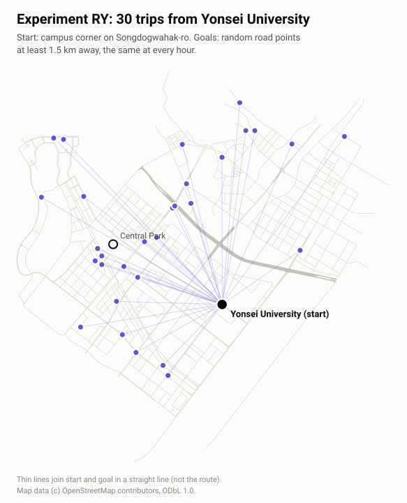

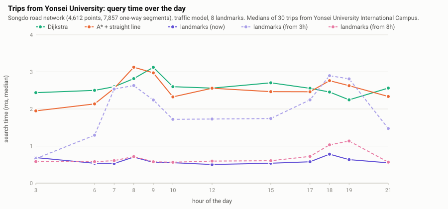

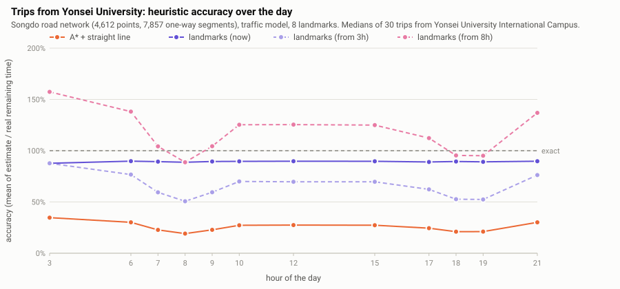

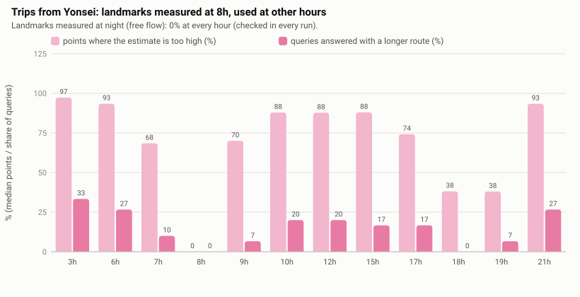

| hour | method | time ms | points expanded | accuracy | points overestimated | queries with a longer route | worst extra time | landmark precompute ms |
| --- | --- | ---: | ---: | ---: | ---: | ---: | ---: | ---: |
| 3h | Dijkstra | 2.44 | 1,827 | - | 0% | 0% | 0 | - |
| 3h | A* + straight line | 1.95 | 805 | 35% | 0% | 0% | 0 | - |
| 3h | landmarks measured this hour | 0.69 | 112 | 88% | 0% | 0% | 0 | 125 |
| 3h | landmarks measured at night (3h) | 0.66 | 112 | 88% | 0% | 0% | 0 | 125 |
| 3h | landmarks measured at 8h | 0.58 | 88 | 157% | 97% | 33% | +19.4% | 107 |
| 6h | Dijkstra | 2.50 | 1,900 | - | 0% | 0% | 0 | - |
| 6h | A* + straight line | 2.14 | 905 | 30% | 0% | 0% | 0 | - |
| 6h | landmarks measured this hour | 0.54 | 76 | 90% | 0% | 0% | 0 | 46 |
| 6h | landmarks measured at night (3h) | 1.29 | 252 | 77% | 0% | 0% | 0 | 125 |
| 6h | landmarks measured at 8h | 0.58 | 83 | 138% | 93% | 27% | +19.0% | 107 |
| 7h | Dijkstra | 2.60 | 2,010 | - | 0% | 0% | 0 | - |
| 7h | A* + straight line | 2.55 | 1,078 | 23% | 0% | 0% | 0 | - |
| 7h | landmarks measured this hour | 0.53 | 83 | 89% | 0% | 0% | 0 | 45 |
| 7h | landmarks measured at night (3h) | 2.54 | 460 | 59% | 0% | 0% | 0 | 125 |
| 7h | landmarks measured at 8h | 0.61 | 88 | 104% | 68% | 10% | +1.2% | 107 |
| 8h | Dijkstra | 2.82 | 2,076 | - | 0% | 0% | 0 | - |
| 8h | A* + straight line | 3.13 | 1,205 | 19% | 0% | 0% | 0 | - |
| 8h | landmarks measured this hour | 0.70 | 124 | 89% | 0% | 0% | 0 | 107 |
| 8h | landmarks measured at night (3h) | 2.63 | 554 | 51% | 0% | 0% | 0 | 125 |
| 8h | landmarks measured at 8h | 0.72 | 124 | 89% | 0% | 0% | 0 | 107 |
| 9h | Dijkstra | 3.12 | 2,000 | - | 0% | 0% | 0 | - |
| 9h | A* + straight line | 2.98 | 1,062 | 23% | 0% | 0% | 0 | - |
| 9h | landmarks measured this hour | 0.56 | 82 | 89% | 0% | 0% | 0 | 49 |
| 9h | landmarks measured at night (3h) | 2.24 | 446 | 59% | 0% | 0% | 0 | 125 |
| 9h | landmarks measured at 8h | 0.58 | 85 | 104% | 70% | 7% | +2.8% | 107 |
| 10h | Dijkstra | 2.60 | 1,925 | - | 0% | 0% | 0 | - |
| 10h | A* + straight line | 2.33 | 952 | 27% | 0% | 0% | 0 | - |
| 10h | landmarks measured this hour | 0.55 | 82 | 90% | 0% | 0% | 0 | 48 |
| 10h | landmarks measured at night (3h) | 1.72 | 336 | 70% | 0% | 0% | 0 | 125 |
| 10h | landmarks measured at 8h | 0.56 | 83 | 125% | 88% | 20% | +17.9% | 107 |
| 12h | Dijkstra | 2.56 | 1,924 | - | 0% | 0% | 0 | - |
| 12h | A* + straight line | 2.56 | 966 | 27% | 0% | 0% | 0 | - |
| 12h | landmarks measured this hour | 0.50 | 76 | 90% | 0% | 0% | 0 | 46 |
| 12h | landmarks measured at night (3h) | 1.73 | 337 | 70% | 0% | 0% | 0 | 125 |
| 12h | landmarks measured at 8h | 0.59 | 83 | 125% | 88% | 20% | +17.5% | 107 |
| 15h | Dijkstra | 2.71 | 1,916 | - | 0% | 0% | 0 | - |
| 15h | A* + straight line | 2.47 | 955 | 27% | 0% | 0% | 0 | - |
| 15h | landmarks measured this hour | 0.54 | 76 | 90% | 0% | 0% | 0 | 47 |
| 15h | landmarks measured at night (3h) | 1.74 | 348 | 70% | 0% | 0% | 0 | 125 |
| 15h | landmarks measured at 8h | 0.60 | 83 | 125% | 88% | 17% | +18.8% | 107 |
| 17h | Dijkstra | 2.56 | 1,756 | - | 0% | 0% | 0 | - |
| 17h | A* + straight line | 2.46 | 1,034 | 24% | 0% | 0% | 0 | - |
| 17h | landmarks measured this hour | 0.58 | 85 | 89% | 0% | 0% | 0 | 51 |
| 17h | landmarks measured at night (3h) | 2.25 | 468 | 62% | 0% | 0% | 0 | 125 |
| 17h | landmarks measured at 8h | 0.72 | 120 | 112% | 74% | 17% | +2.7% | 107 |
| 18h | Dijkstra | 2.46 | 1,718 | - | 0% | 0% | 0 | - |
| 18h | A* + straight line | 2.76 | 1,140 | 21% | 0% | 0% | 0 | - |
| 18h | landmarks measured this hour | 0.78 | 132 | 89% | 0% | 0% | 0 | 48 |
| 18h | landmarks measured at night (3h) | 2.90 | 618 | 53% | 0% | 0% | 0 | 125 |
| 18h | landmarks measured at 8h | 1.03 | 201 | 95% | 38% | 0% | 0 | 107 |
| 19h | Dijkstra | 2.25 | 1,702 | - | 0% | 0% | 0 | - |
| 19h | A* + straight line | 2.63 | 1,105 | 21% | 0% | 0% | 0 | - |
| 19h | landmarks measured this hour | 0.63 | 98 | 89% | 0% | 0% | 0 | 50 |
| 19h | landmarks measured at night (3h) | 2.81 | 620 | 52% | 0% | 0% | 0 | 125 |
| 19h | landmarks measured at 8h | 1.14 | 205 | 95% | 38% | 7% | +0.3% | 107 |
| 21h | Dijkstra | 2.56 | 1,875 | - | 0% | 0% | 0 | - |
| 21h | A* + straight line | 2.34 | 908 | 30% | 0% | 0% | 0 | - |
| 21h | landmarks measured this hour | 0.55 | 82 | 90% | 0% | 0% | 0 | 67 |
| 21h | landmarks measured at night (3h) | 1.47 | 254 | 76% | 0% | 0% | 0 | 125 |
| 21h | landmarks measured at 8h | 0.57 | 82 | 137% | 93% | 27% | +18.5% | 107 |

## Code size

Lines of code without blank lines, comments and docstrings.

| algorithm | code | lines |
| --- | --- | ---: |
| BFS | `bfs` | 23 |
| Dijkstra | `best_first` + `dijkstra` | 61 |
| A* | `best_first` + `astar` (+ `manhattan`) | 65 |
| Bidirectional Dijkstra | `bidirectional_dijkstra` | 64 |
| JPS | `jump_point_search` + `_expand_path` | 136 |
| A* + landmarks | `best_first` + `LandmarkHeuristic` + `choose_landmarks` + `distances_from` | 122 |
| shared by all | `Grid.neighbors`, `reconstruct_path`, `_trivial` | 35 |

Dijkstra and A* share `best_first`, which also carries the options used in the extra experiments (tie-break, weight, heap choice), so their counts include those lines.
